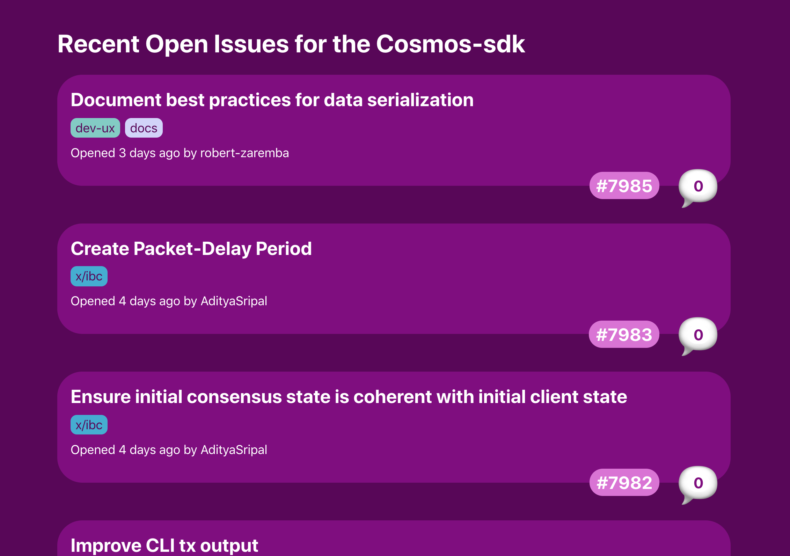

# Graphql and Typescript demo
This repo is a little test app for fetching and displaying github issues for the Cosmos-sdk. 

It uses [Apollo](https://www.apollographql.com/docs/), [Graphql](https://graphql.org/), [Typescript](https://www.typescriptlang.org/docs) and React.

How it should look:

## Getting Started
Clone the repo and install the dependencies with with `npm install`. In order to query github's api, you will need to [create an access token with your account](https://github.com/settings/tokens) and save it as the environment variable `REACT_APP_GH_TOKEN` in a `.env` file. Feel free to use this dummy token `b2794c4164de13171cb08b317e0e9f0d830d2677`.

### 📯SECURITY NOTE📯 
Do not enable any permissions on the token you create, since your token will be exposed if deployed to a publicly accessible site. Also since we are querying a public repo, no permissions are necessary.

## Running the app

In the project directory, you can run:

### `npm start`

Runs the app in the development mode.\
Open [http://localhost:3000](http://localhost:3000) to view it in the browser.

The page will reload if you make edits.\
You will also see any lint errors in the console.

### `npm run build`

Builds the app for production to the `build` folder.\
It correctly bundles React in production mode and optimizes the build for the best performance.

The build is minified and the filenames include the hashes.

## Directory Structure
It's an ejected `create-react-app`, so `/config` and `/scripts` contain the config (webpack, etc.) and script running files.

- `/src/components` - React components
- `/src/lib` - libraries and utilities, most notably the Apollo client and queries
- `/src/types` — contains type definitions

